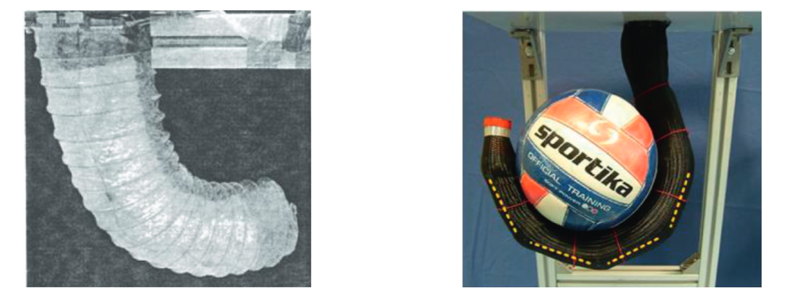
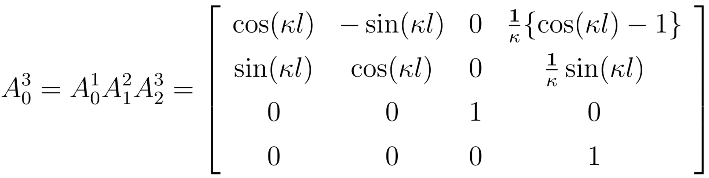
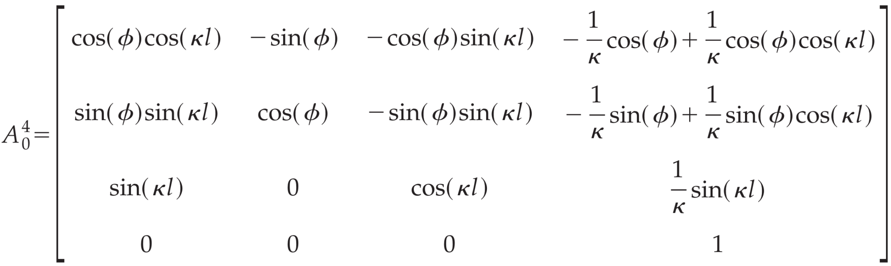

# Planar and Spatial Robot Kinematics with Constant Curvature Representation

* **Author:** [Turhan Can Kargın](https://github.com/turhancan97)

This repository is prepared for the first part of my master thesis which is called [The Control of Soft Continuum Robot by Reinforcement Learning](https://github.com/turhancan97/RL-based-Control-of-a-Soft-Continuum-Robot). Main purpose of this repository is to show 2D and 3D Kinematic Modeling of Constant Curvature Continuum Robots via MATLAB and Python.

---

## Table of Contents

* [How to use?](#how-to-use)
* [What is Continuum Robot?](#what-is-continuum-robot)
* [Definition of Kinematic Modeling](#definition-of-kinematic-modeling)
* [Mathematical Background](#mathematical-background)
    * [2D Kinematic Modeling](#2d-kinematic-modeling)
    * [3D Kinematic Modeling](#3d-kinematic-modeling)
* [References](#references)

---

## How to use?
You can use this repository in two ways. First one is to use MATLAB files and second one is to use Python files. If you want to use MATLAB files, you can simply open the files and run the main.m file. If you want to use Python files, you can run them in your terminal. For example, if you want to run the 2D Kinematic Modeling of Constant Curvature Continuum Robot, you can run the following command in your terminal:

```bash
cd 2D\ Constant\ Curvature\ Kinematics/Python/
python main.py
```
---
## What is Continuum Robot?

Continuum robots were created to draw inspiration from the natural abilities and particularly flexibility of many biological organisms, such as snakes, elephant trunks, octopus tentacles, and other similar creatures. Contrary to traditional rigid joint manipulators, continuum robots bend by creating a sequence of continuous non-joint arcs. Such designs, after much research and development in academia, have recently focused on large-scale grasping, locomotion and positioning in industrial applications, search and rescue operations in confined spaces, or particularly surgical applications. Medical applications benefit from the continuum robots’ adaptable qualities. With the ability to manipulate objects with an infinite degree of freedom (DoF) on small scales, continuum robots provide the target with flexible access and the patient with less intrusion. You can see the example continuum robots in the Figure below.
<p align="center">

<a href=https://www.hindawi.com/journals/jr/2020/4187048/>
<figcaption>Source: Kolachalama, S.; Lakshmanan, S.; Wang, W. Continuum Robots for Manipulation Applications: A Survey. J. Robot. Volume 2020, Article ID 4187048.</figcaption> </a>
</p>

---
## Definition of Kinematic Modeling
Many engineering problems can be modeled using concepts from kinematics. Kinematics is the branch of physics that studies how things physically move. In order to represent engineering problems, it is commonly assumed that the items involved are solid (rigid), meaning that they do not deform under shear loads. Kinematics is the study of the relationship between an object's reference coordinate system and its location, velocity, acceleration, and jerk values. Although kinematics is interested in the qualities of physical things, it is not concerned with the forces and moments that generate motion. Dynamics is the discipline of physics concerned with the study of the forces and moments that produce motion. To analyze engineered physical systems and provide solutions to engineering problems, kinematics is employed.

In robotic systems, the study of kinematics includes topics like forward kinematics, inverse kinematics, and velocity kinematics. This repository show the forward kinematics of constant curvature continuum robots.

In this context, forwards kinematic analysis of continuum robot sections added one after another is concerned with the position and orientation of the robot’s tip point in the task space, according to the translational or rotational motion of the end section points to which the robot’s limbs are attached. Thus, depending on the change of the curvature variables of the robot, the position and orientation of the tip of the robot in task space changes. Inverse kinematics determines what the curvature variables of the robot should be in order for the robot to achieve the targeted position and orientation in the task space. To better understand the forward and inverse kinematics of continuum robots, it is necessary to see the Figure below.

<p align="center">

<a href=https://doi.org/10.3389/frobt.2021.730330>
<figcaption>Source: X. Wang, Y. Li, and K. Kwok. A survey for machine learning-based control of continuum robots. Frontiers in Robotics and AI, 8:280, 2021.</figcaption> </a>
</p>

---
## Mathematical Background
There are different methods in the literature for forward kinematic modelling of continuum robots. We used Denavit Hartenberg (DH) method for modelling.

We must first comprehend how to measure the motions of continuum designs. Due to the continuous nature of the design, unlike traditional manipulators, the use of joint angles and joint lengths does not provide a simple and physically feasible description of the shape of the manipulator. Instead, a kinematic model that describes the geometry of the manipulator using curvatures can offer a more real and understandable description of the manipulator.

Three coupled movements can be used to describe how a planar curve moves with constant curvature approach:

1. rotation by an angle $\theta$
2. translation by an amount of $\parallel x\parallel$, and
3. rotation by the angle $\theta$ again,

where x is defined to be the position vector of the endpoint of the curve.

Now we have a description of the motion of the curve in terms of discrete movements. We can now apply a modified Denavit-Hartenberg (D-H) procedure for the forward kinematic analysis as would be done for conventional manipulators.

### 2D Kinematic Modeling
Using the D-H table that [Hannan and Walker](https://onlinelibrary.wiley.com/doi/10.1002/rob.10070) obtained in their paper the homogeneous transformation matrix for the curve can be written in terms of the curvature $\kappa$ and the total arc length $l$ for planar (2D) case as:
<p align="center">

<figcaption>Homogeneous transformation matrix for the planar continuum robot<figcaption>
</p>

### 3D Kinematic Modeling
The forward kinematics for a spatial robot can be easily generated from the planar case. After analyzing a spatial curve with only constant curvature and no torsion, the curve can be viewed as a planar curve rotated out of the plane. Using this concept, we can apply the planar kinematic technique with only the addition of an angle of rotation about the initial tangent. Therefore, we obtain the transformation matrix in terms of the curvature $\kappa$, the total arc length $l$ of the curve, and the rotation angle $\phi$ about the tangent for spatial (3D) case as:
<p align="center">

<figcaption>Homogeneous transformation matrix for the spatial continuum robot<figcaption>
</p>

This homogeneous transformation matrix gives the forward kinematics for one section of a spatial continuum robot. Note that since $\kappa$ can take on both positive and negative values, $\phi$ needs to only take on the values in a range of $\pi$ to uniquely describe the curve in space. The forward kinematics for an n section manipulator can then be generated by the product of n matrices.

---
## References
1. [Forward kinematics of continuum robots with constant curvature.](https://onlinelibrary.wiley.com/doi/10.1002/rob.10070)

2. [Continuum Robots for Manipulation Applications: A Survey](https://www.hindawi.com/journals/jr/2020/4187048/)

3. [A survey for machine learning-based control of continuum robots](https://doi.org/10.3389/frobt.2021.730330)

4. [How to Model Tendon-Driven Continuum Robots and Benchmark Modelling Performance](https://www.frontiersin.org/articles/10.3389/frobt.2020.630245/full)

5. [Design and Kinematic Modeling of Constant Curvature Continuum Robots: A Review](https://www.researchgate.net/publication/220121941_Design_and_Kinematic_Modeling_of_Constant_Curvature_Continuum_Robots_A_Review)


